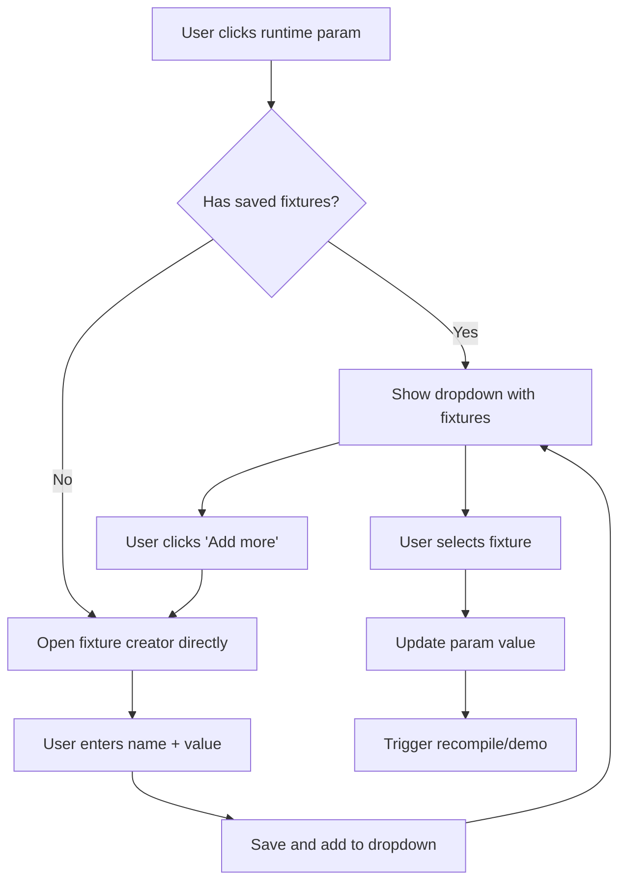

<!-- fullWidth: false tocVisible: false tableWrap: true -->
# Params Window Dropdown Enhancement Plan

## Overview

Add dropdown functionality to runtime params in the params window. When clicking a runtime param:

- Show a dropdown with saved fixture values
- Last option should be "Add more"
- If no saved values exist, directly open the fixture creator

## Current Behavior Analysis

### Existing Implementation (`plans/dot_prompt_editor_v4.html`)

The current params panel (`.ppane`) has:

- **Compile-time params**: Use `<select>` elements with `instantRecompile()`
- **Runtime params**: Use `<input class="pi rt">` with `onclick="openPop()"` to show popovers

Current runtime params in the demo:

1. `@user_level` - enum type with fixture "beginner student", "advanced dev"
2. `@user_message` - str type with fixtures "example request", "push for more", "off-topic question"

### Current Popover Structure

```html
<div class="popover" id="pop-ul">
  <div class="pop-head">@user_level<span class="pop-close">×</span></div>
  <input class="pop-input">
  <div class="pop-flbl">Saved fixtures</div>
  <div class="pf-row" onclick="loadFix()">...</div>
  <button class="pop-save" onclick="saveFix()">Save current as fixture…</button>
</div>
```

---

## Requirements

1. **Dropdown on click**: Runtime params should show a dropdown menu, not a popover
2. **"Add more" as last option**: The dropdown should end with an "Add more" option
3. **Empty state handling**: If no saved values, show the fixture creator directly
4. **Fixture creator**: Allow users to save named test values for runtime params (e.g. `@user_history`, `@user_message`) to prototype with

---

## Implementation Plan

### Phase 1: Convert Popovers to Dropdowns

Modify the runtime param inputs to use a custom dropdown instead of popover:

```html
<!-- Current (needs change) -->
<input class="pi rt" id="rt-ul" readonly value="intermediate" onclick="openPop('pop-ul','rt-ul')">

<!-- New structure -->
<div class="param-dropdown" data-param="rt-ul">
  <input class="pi rt" id="rt-ul" readonly value="intermediate" onclick="toggleDropdown('rt-ul')">
  <div class="dd-menu" id="dd-rt-ul">
    <div class="dd-option" onclick="selectValue('rt-ul', 'beginner')">beginner</div>
    <div class="dd-option" onclick="selectValue('rt-ul', 'advanced')">advanced</div>
    <div class="dd-divider"></div>
    <div class="dd-option dd-add-more" onclick="openFixtureCreator('rt-ul')">+ Add more</div>
  </div>
</div>
```

### Phase 2: Add CSS for Dropdown

```css
.param-dropdown{position:relative}
.dd-menu{display:none;position:absolute;top:100%;left:0;right:0;background:var(--s2);border:0.5px solid var(--b3);border-radius:6px;padding:4px;z-index:40;max-height:200px;overflow-y:auto}
.dd-menu.open{display:block}
.dd-option{padding:6px 10px;border-radius:4px;cursor:pointer;font-size:11px;color:var(--mu2);transition:all 0.1s}
.dd-option:hover{background:var(--s3);color:var(--tx)}
.dd-option.selected{background:var(--grg);color:var(--gr)}
.dd-divider{height:0.5px;background:var(--b1);margin:4px 0}
.dd-add-more{color:var(--am);font-weight:500;border-top:0.5px solid var(--b1);margin-top:4px;padding-top:8px}
.dd-add-more:hover{background:var(--amg)}
```

### Phase 3: Fixture Creator Panel

When "Add more" is clicked, or if a param has no saved values, show the fixture creator. This is a simple panel for saving named test values to prototype with:

```html
<div class="fixture-creator" id="fc-rt-ul">
  <div class="fc-header">
    <span>New fixture for @user_level</span>
    <button onclick="closeFixtureCreator()">×</button>
  </div>
  <input class="fc-name" placeholder="Fixture name (e.g. 'power user')">
  <textarea class="fc-value" placeholder="Value..."></textarea>
  <button class="btn btn-gr" onclick="saveFixture('rt-ul')">Save</button>
</div>
```

### Phase 4: JavaScript Functions

```javascript
// Toggle dropdown visibility
function toggleDropdown(paramId) {
  closeAllDropdowns();
  const menu = document.getElementById('dd-' + paramId);
  if (menu) menu.classList.toggle('open');
}

// Close dropdown when clicking outside
document.addEventListener('click', function(e) {
  if (!e.target.closest('.param-dropdown')) closeAllDropdowns();
});

function closeAllDropdowns() {
  document.querySelectorAll('.dd-menu.open').forEach(m => m.classList.remove('open'));
}

// Select a value from dropdown
function selectValue(paramId, value) {
  document.getElementById(paramId).value = value;
  closeAllDropdowns();
  // Trigger recompile if needed
}

// Open fixture creator
function openFixtureCreator(paramId) {
  closeAllDropdowns();
  const fc = document.getElementById('fc-' + paramId);
  if (fc) fc.classList.add('open');
}

function closeFixtureCreator() {
  document.querySelectorAll('.fixture-creator.open').forEach(fc => fc.classList.remove('open'));
}

// Save fixture and add to dropdown
function saveFixture(paramId) {
  const fc = document.getElementById('fc-' + paramId);
  const name = fc.querySelector('.fc-name').value.trim();
  const value = fc.querySelector('.fc-value').value.trim();
  if (!name || !value) return;
  addToDropdown(paramId, name, value);
  closeFixtureCreator();
}

// Handle empty state - show fixture creator directly
function checkEmptyAndOpen(paramId, values) {
  if (!values || values.length === 0) {
    openFixtureCreator(paramId);
    return true;
  }
  return false;
}
```

---

## Data Flow



---

## File Changes Required

| File | Changes |
| ---- | ------- |
| `plans/dot_prompt_editor_v4.html` | Add dropdown CSS, modify runtime param HTML structure, add fixture creator panel, add JavaScript functions |

---

## Acceptance Criteria

1. ✅ Clicking a runtime param opens a dropdown (not popover)
2. ✅ Dropdown shows saved fixture values
3. ✅ "Add more" is the last option in dropdown
4. ✅ If no saved values, fixture creator opens directly
5. ✅ Fixture creator allows saving a named value (name + textarea)
6. ✅ Created fixture appears in dropdown immediately after saving
7. ✅ Clicking outside closes the dropdown
8. ✅ Demo/testing works with new fixture values