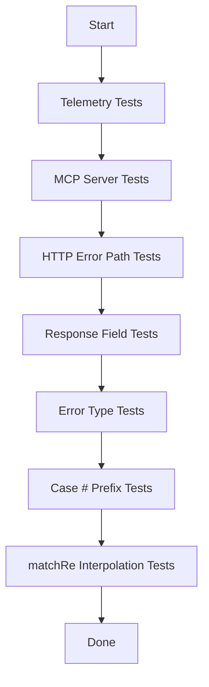

# Test Coverage Gap Remediation Plan

## Executive Summary

This document outlines the plan to address critical and important test coverage gaps identified in the dot-prompt project. The gaps span HTTP endpoint tests, MCP server tests, telemetry verification, response field validation, and edge case handling.

---

## Priority 1: Critical Issues

### 1.1 Zero Telemetry Test Coverage (Spec-Mandated Events)

**Current State:** The [`DotPrompt.Telemetry`](dot_prompt/apps/dot_prompt/lib/dot_prompt/telemetry.ex) module emits two key events:
- `[:render, :start]` - Emitted when a render begins with `system_time`, `prompt`, and `params`
- `[:render, :stop]` - Emitted when render completes with `duration`, `compiled_tokens`, `vary_selections`, and `cache_hit`

**Required Actions:**
1. Create `test/dot_prompt/telemetry_test.exs` to verify telemetry events are emitted correctly
2. Use `ExUnit.Case.register_attribute` to capture telemetry events during tests
3. Test that start events contain prompt name and params
4. Test that stop events contain compiled_tokens, vary_selections, cache_hit
5. Test that events are NOT emitted on compilation-only (compile/compile_to_iodata) calls

**Test Locations:**
- New: `dot_prompt/apps/dot_prompt/test/dot_prompt/telemetry_test.exs`

---

### 1.2 MCP Tools Untested (prompt_schema, collection_schema, collection_list)

**Current State:** The [`DotPromptServer.MCP.Server`](dot_prompt/apps/dot_prompt_server/lib/dot_prompt_server/mcp/server.ex) implements 5 methods:
- `prompt_list` - Returns all prompts (possibly tested via other means)
- `prompt_compile` - Compiles a prompt with params
- `prompt_schema` - UNTESTED
- `collection_schema` - UNTESTED  
- `collection_list` - UNTESTED

**Required Actions:**
1. Create `test/dot_prompt_server/mcp/server_test.exs`
2. Test `prompt_schema` with valid prompt name returns schema
3. Test `prompt_schema` with non-existent prompt returns error
4. Test `collection_schema` with valid collection returns schema
5. Test `collection_schema` with non-existent collection returns error
6. Test `collection_list` returns all collections

**Test Locations:**
- New: `dot_prompt/apps/dot_prompt_server/test/dot_prompt_server/mcp/server_test.exs`

---

## Priority 2: Important Issues

### 2.1 No HTTP Error Path Tests

**Current State:** Only happy-path tests exist in:
- [`CompileControllerTest`](dot_prompt/apps/dot_prompt_server/test/dot_prompt_server_web/controllers/compile_controller_test.exs)
- [`RenderControllerTest`](dot_prompt/apps/dot_prompt_server/test/dot_prompt_server_web/controllers/render_controller_test.exs)

**Required Actions:**
1. **CompileController Error Tests:**
   - Test 400/422 for invalid prompt syntax
   - Test 422 for missing required params
   - Test 422 for invalid param types

2. **RenderController Error Tests:**
   - Test 422 for missing required params
   - Test 500 for internal errors (malformed prompt content that passes compile but fails render)

3. **SchemaController Error Tests:**
   - Test 404 for non-existent prompt file

4. **InjectController Error Tests:**
   - Test 422 for invalid runtime variables

5. **PromptsController Error Tests:**
   - Test edge cases (empty prompts directory)

**Test Locations:**
- Extend: `dot_prompt/apps/dot_prompt_server/test/dot_prompt_server_web/controllers/compile_controller_test.exs`
- Extend: `dot_prompt/apps/dot_prompt_server/test/dot_prompt_server_web/controllers/render_controller_test.exs`
- New: `dot_prompt/apps/dot_prompt_server/test/dot_prompt_server_web/controllers/schema_controller_test.exs`
- Extend: `dot_prompt/apps/dot_prompt_server/test/dot_prompt_server_web/controllers/inject_controller_test.exs`
- Extend: `dot_prompt/apps/dot_prompt_server/test/dot_prompt_server_web/controllers/prompts_controller_test.exs`

---

### 2.2 Response Fields Unverified

**Current State:** API responses include `compiled_tokens`, `injected_tokens`, and `vary_selections` but these are not verified in tests.

**Required Actions:**
1. **compiled_tokens:** Verify integer value matches token count of compiled template
2. **injected_tokens:** Verify integer value matches token count of final rendered output
3. **vary_selections:** Verify map structure contains variant selections

**Implementation:**
- Add assertions in existing compile/render controller tests
- Create parameterized tests with different prompt complexities
- Test token counts are non-zero for non-empty prompts

---

### 2.3 Missing Error Type Tests

**Current State:** No tests verify error handling for edge cases in prompt processing.

**Required Actions:**
1. **Index File Missing:** Test that accessing prompts when index file is corrupted/missing produces appropriate error
2. **Collection No Match:** Test that collection fragment filtering with no matching fragments produces appropriate error

**Note:** The specific error messages "missing_index" and "collection_no_match" were not found in the codebase - likely these refer to general error paths that need testing.

**Test Strategy:**
- Test cache corruption scenarios
- Test missing prompt files
- Test invalid collection configurations

---

### 2.4 Case Title #-prefix Stripping Unverified

**Current State:** The [`CaseResolver`](dot_prompt/apps/dot_prompt/lib/dot_prompt/compiler/case_resolver.ex) processes case branch labels that can have `#` prefix (e.g., `#Track` becomes `Track`). The [`Lexer`](dot_prompt/apps/dot_prompt/lib/dot_prompt/parser/lexer.ex) handles this at line 119.

**Required Actions:**
1. Create test that uses case branches with `#` prefix in labels
2. Verify the `#` is stripped from the final output
3. Test edge cases: `##Prefix`, `#`, only whitespace after #

**Test Locations:**
- New: `dot_prompt/apps/dot_prompt/test/dot_prompt/compiler/case_resolver_test.exs` (or add to existing compiler tests)

---

### 2.5 matchRe @variable Interpolation Test Missing

**Current State:** The [`collection.ex`](dot_prompt/apps/dot_prompt/lib/dot_prompt/compiler/fragment_expander/collection.ex) has `interpolate_vars/1` function for matching regex with variable interpolation. The [`validator.ex`](dot_prompt/apps/dot_prompt/lib/dot_prompt/parser/validator.ex) validates matchRe with `@variables`.

**Required Actions:**
1. Test matchRe with @variable interpolation works correctly
2. Test runtime variables are substituted into regex pattern
3. Test invalid regex after interpolation fails gracefully
4. Test multiple @variables in same matchRe

**Test Locations:**
- Extend: `dot_prompt/apps/dot_prompt/test/dot_prompt/compiler/fragment_expander/collection_test.exs`

---

## Implementation Order



## Test File Structure

```
dot_prompt/apps/dot_prompt/test/dot_prompt/
├── telemetry_test.exs           [NEW]
├── compiler/
│   ├── case_resolver_test.exs  [NEW]
│   └── fragment_expander/
│       └── collection_test.exs [EXTEND]

dot_prompt/apps/dot_prompt_server/test/
├── dot_prompt_server/
│   └── mcp/
│       └── server_test.exs     [NEW]
└── dot_prompt_server_web/
    └── controllers/
        ├── compile_controller_test.exs    [EXTEND]
        ├── render_controller_test.exs      [EXTEND]
        ├── schema_controller_test.exs     [NEW]
        ├── inject_controller_test.exs     [EXTEND]
        └── prompts_controller_test.exs     [EXTEND]
```

## Key Dependencies

- **Telemetry Testing:** Uses Elixir's built-in `:telemetry` package for event capture
- **MCP Testing:** Direct function calls to `DotPromptServer.MCP.Server.process_request/1`
- **Controller Testing:** Uses `DotPromptServerWeb.ConnCase` for Phoenix controller tests
- **Property-based testing:** Consider using `StreamData` for token count verification

## Notes

1. Some issues may be interdependent - completing telemetry tests will help verify response field tests
2. Error path tests should use `conn_test` macros with proper status codes
3. All new test files should include async: true where appropriate
4. Consider adding doctests for the Telemetry module functions