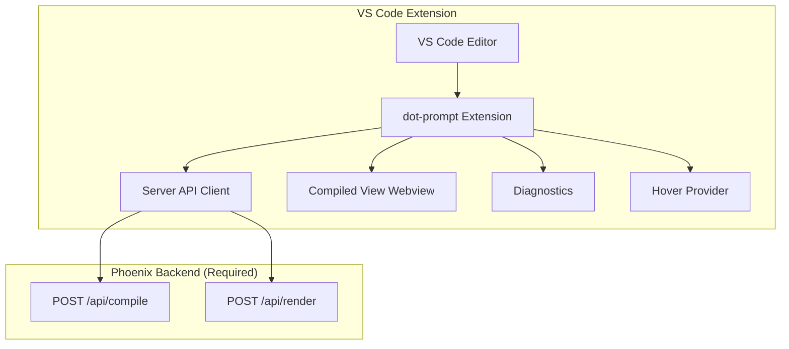

# VS Code Compiled View Webview — Server-Backed Plan

## Overview

This plan focuses on implementing the **compiled view** as a VS Code webview for `.prompt` files, using a **server-backed architecture** where the extension calls the existing Phoenix backend API for compilation.

### Key Change from Previous Plan

> **Important:** The server is always required for the application to compile prompts. There is no scenario where someone uses `.prompt` without the server. This means:
> - ❌ No local TypeScript compiler reimplementation needed
> - ✅ Extension calls existing backend API for compilation
> - ✅ Simpler architecture with less code to maintain

---

## Architecture



### API Endpoints Used

| Endpoint | Method | Purpose |
|----------|--------|---------|
| `/api/compile` | POST | Compile .prompt with params, get template, tokens, vary selections, contract |
| `/api/render` | POST | Render compiled template with runtime params |

### Compile API Response Format

```typescript
interface CompileResponse {
  template: string;           // Compiled prompt template
  cache_hit: boolean;        // Whether cache was used
  compiled_tokens: any[];    // Tokenized result
  vary_selections: Record<string, string>;  // Which vary cases selected
  response_contract: {       // Response schema/contract
    type: string;
    schema?: object;
    json_schema?: object;
  };
  warnings: string[];         // Compilation warnings
}
```

---

## Phase 1: Project Setup

### 1.1 Create VS Code Extension Structure

```
dot_prompt_vscode/
├── package.json
├── tsconfig.json
├── src/
│   ├── extension.ts          # Entry point, activate()
│   ├── api/
│   │   ├── client.ts         # Server API client
│   │   └── types.ts          # API response types
│   ├── commands.ts           # Command handlers
│   ├── diagnostics.ts        # Diagnostic provider
│   ├── hover.ts              # Hover provider
│   └── webview/
│       ├── compiledView.ts   # Webview panel logic
│       └── messageHandler.ts # Handle messages from webview
└── webviews/
    └── compiled/
        ├── index.html        # Webview HTML
        ├── styles.css       # Webview styles
        └── script.js        # Webview script
```

### 1.2 Configure package.json

- Add `.prompt` file association
- Register commands
- Configure webview location

---

## Phase 2: Server API Integration

### 2.1 API Client

Create `src/api/client.ts`:

```typescript
// Server configuration
const SERVER_URL = process.env.DOT_PROMPT_SERVER || 'http://localhost:4000';

// Compile endpoint
async function compile(prompt: string, params: Record<string, any>): Promise<CompileResponse> {
  const response = await fetch(`${SERVER_URL}/api/compile`, {
    method: 'POST',
    headers: { 'Content-Type': 'application/json' },
    body: JSON.stringify({ prompt, params })
  });
  return response.json();
}

// Render endpoint  
async function render(template: string, params: Record<string, any>): Promise<RenderResponse> {
  // ... similar implementation
}
```

### 2.2 Error Handling

- Handle network errors (server unreachable)
- Handle compilation errors (invalid .prompt syntax)
- Handle timeout errors

---

## Phase 3: Compiled View Webview (Primary Feature)

### 3.1 Webview Panel

Create webview that displays compiled output:

**Features:**
- Full compiled prompt template (with syntax highlighting)
- Section breakdown (system, user, assistant, vary)
- Token count
- Cache status
- Warnings display
- Vary selections (if any)
- Response contract display

### 3.2 Webview UI

```html
<!-- webviews/compiled/index.html -->
<div class="compiled-view">
  <header class="toolbar">
    <button id="compile-btn">▶ Compile</button>
    <span class="token-count">Tokens: ~1200</span>
    <span class="cache-status cache-hit">✓ Cache</span>
  </header>
  
  <div class="sections">
    <!-- Section tabs: System, User, Assistant, Raw -->
    <div class="section system">
      <div class="section-header">System</div>
      <pre class="content">...compiled content...</pre>
    </div>
    
    <div class="section vary-selections">
      <div class="section-header">Vary Selections</div>
      <ul>
        <li>scenario: "production" (case block)</li>
      </ul>
    </div>
  </div>
  
  <div class="response-contract">
    <div class="contract-header">Response Contract</div>
    <pre>...JSON schema...</pre>
  </div>
  
  <div class="warnings" hidden>
    <div class="warnings-header">⚠ Warnings</div>
    <ul>...</ul>
  </div>
</div>
```

### 3.3 Styling

Use dark theme matching VS Code:

```css
/* webviews/compiled/styles.css */
.compiled-view {
  background: #1e1e1e;
  color: #d4d4d4;
  font-family: 'Consolas', monospace;
  padding: 16px;
}

.section {
  margin-bottom: 16px;
  border: 1px solid #3c3c3c;
  border-radius: 4px;
}

.section-header {
  background: #252526;
  padding: 8px 12px;
  font-weight: 600;
  border-bottom: 1px solid #3c3c3c;
}

/* Syntax highlighting */
.system { border-left: 3px solid #dcdcaa; }
.user { border-left: 3px solid #9cdcfe; }
.assistant { border-left: 3px solid #ce9178; }
.vary { border-left: 3px solid #c586c0; }

.cache-hit { color: #4ec9b0; }
.cache-miss { color: #dcdcaa; }
```

### 3.4 Webview Communication

```typescript
// In compiledView.ts
const panel = vscode.window.createWebviewPanel(
  'dotPromptCompiled',
  'Compiled View',
  vscode.ViewColumn.Two,
  { enableScripts: true }
);

// Send compiled result to webview
panel.webview.postMessage({
  type: 'display',
  data: compileResult
});

// Handle messages from webview
panel.webview.onMessage(message => {
  if (message.type === 'copy') {
    // Copy to clipboard
  } else if (message.type === 'navigate') {
    // Navigate to line in editor
  }
});
```

---

## Phase 4: Inline Editor Features

### 4.1 Hover Provider

Hover over sections → show compiled preview:

```typescript
// src/hover.ts
vscode.languages.registerHoverProvider('prompt', {
  provideHover(document, position) {
    // Call compile API with current params
    // Return markdown with preview
  }
});
```

### 4.2 Diagnostics

Map compilation errors to line numbers:

```typescript
// src/diagnostics.ts
const diagnosticCollection = vscode.languages.createDiagnosticCollection('prompt');

function updateDiagnostics(document: TextDocument) {
  // Call compile API
  // Map errors.warnings to line ranges
  // Update diagnosticCollection
}
```

### 4.3 CodeLens Actions

Add inline actions:
- `▶ Compile` - compile and show result
- `🔍 Preview` - open compiled view

---

## Phase 5: Configuration & Settings

### 5.1 Server URL Configuration

Add setting: `dotPrompt.serverUrl`

```json
{
  "dotPrompt.serverUrl": "http://localhost:4000",
  "dotPrompt.autoCompile": true,
  "dotPrompt.compileDelay": 300
}
```

### 5.2 Workspace Trust

Handle untrusted workspace scenarios

---

## Implementation Checklist

- [ ] Phase 1: Project Setup
  - [ ] Create extension structure
  - [ ] Configure package.json for .prompt files
  - [ ] Set up logging

- [ ] Phase 2: Server API Integration
  - [ ] Implement API client (compile endpoint)
  - [ ] Add error handling for network/timeout
  - [ ] Test connection to Phoenix server

- [ ] Phase 3: Compiled View Webview
  - [ ] Create webview panel
  - [ ] Implement HTML/CSS layout
  - [ ] Add syntax highlighting for sections
  - [ ] Display vary selections
  - [ ] Display response contract
  - [ ] Display warnings
  - [ ] Add copy functionality

- [ ] Phase 4: Inline Features
  - [ ] Implement hover provider
  - [ ] Implement diagnostic provider
  - [ ] Add CodeLens actions

- [ ] Phase 5: Configuration
  - [ ] Add server URL setting
  - [ ] Add auto-compile setting
  - [ ] Handle workspace trust

---

## Estimated Complexity

| Component | Complexity | Notes |
|-----------|------------|-------|
| API Client | Low | Simple REST calls |
| Webview HTML/CSS | Medium | Need to match LiveView features |
| Webview Script | Low | Message passing |
| Hover Provider | Low | Call API, format markdown |
| Diagnostics | Medium | Map errors to line numbers |

**Total new code:** ~500-800 lines (vs 1000+ with local compiler)